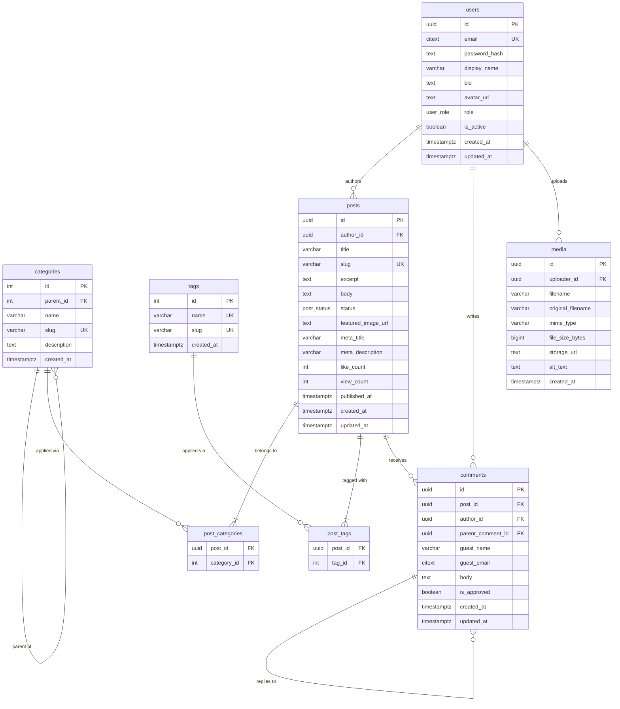

# Blogging / CMS — PostgreSQL Schema

> **TBDSP domain:** Blogging / CMS | **Database:** PostgreSQL 14+

This schema models a fully-featured blogging and content-management platform covering authors, a hierarchical category system, flexible tagging, a rich post publishing workflow, threaded comments (supporting both registered users and anonymous guests), and media asset tracking.

---

## Table of Contents

1. [Entity-Relationship Diagram](#entity-relationship-diagram)
2. [Tables at a Glance](#tables-at-a-glance)
3. [Table Details](#table-details)
4. [Design Decisions](#design-decisions)
5. [Setup Instructions](#setup-instructions)
6. [Sample Queries](#sample-queries)

---

## Entity-Relationship Diagram



> The standalone Mermaid source is also available in [`erd.mmd`](erd.mmd).

---

## Tables at a Glance

| Table | Rows (sample) | Purpose |
|-------|:---:|---------|
| `users` | 5 | Author accounts and editorial staff |
| `categories` | 8 | Hierarchical post taxonomy |
| `tags` | 12 | Flat cross-cutting keyword labels |
| `posts` | 12 | Blog articles (published and draft) |
| `post_categories` | 21 | Many-to-many: posts ↔ categories |
| `post_tags` | 30 | Many-to-many: posts ↔ tags |
| `comments` | 18 | Threaded comments (users + guests, with moderation) |
| `media` | 8 | Uploaded images and file assets |

---

## Table Details

### `users`

Stores blog authors and editorial staff. Email is stored as `CITEXT` so uniqueness is enforced case-insensitively. Passwords are **never** stored in plain text — only a cryptographic hash (bcrypt / Argon2).

The `role` enum governs access within the application layer:

| Role | Access level |
|------|-------------|
| `admin` | Full platform access — users, settings, all content |
| `editor` | Can create, edit, publish, and delete any post |
| `author` | Can create and manage their own posts only |

Key columns:

| Column | Type | Notes |
|--------|------|-------|
| `id` | `UUID` | Surrogate PK — prevents enumeration attacks |
| `email` | `CITEXT` | Unique login identifier, case-insensitive |
| `password_hash` | `TEXT` | bcrypt / Argon2 hash |
| `display_name` | `VARCHAR(150)` | Public-facing author name |
| `role` | `user_role` | Enum controlling access level |
| `is_active` | `BOOLEAN` | Soft-delete / account suspension flag |

---

### `categories`

Uses an **adjacency-list** model (each row has an optional `parent_id`). This enables multi-level taxonomies such as `Technology → Programming → Python`. Use a recursive CTE to query full paths:

```sql
WITH RECURSIVE path AS (
    SELECT id, name, parent_id, 1 AS depth
    FROM   categories WHERE id = :leaf_id
    UNION ALL
    SELECT c.id, c.name, c.parent_id, path.depth + 1
    FROM   categories c
    JOIN   path ON c.id = path.parent_id
)
SELECT name FROM path ORDER BY depth DESC;
```

A post can belong to **multiple categories** via the `post_categories` junction table — useful when an article spans, for example, both "Databases" and "Security".

---

### `tags`

A flat, unordered keyword list. Tags are lower-friction than categories: an author can create a new tag on the fly while writing a post, whereas categories require editorial governance. Both `name` and `slug` have `UNIQUE` constraints to prevent duplicates regardless of case-normalisation in the application.

---

### `posts`

The central content table. Key design points:

- **`body`** stores the full article as `TEXT` (Markdown, HTML, or plain text — the application layer controls rendering).
- **`excerpt`** is a short plain-text summary used on listing pages, RSS feeds, and social previews.
- **`status`** follows the workflow: `draft → published` (or `draft → scheduled → published` for pre-planned releases). `archived` removes the post from public listing without deletion.
- **`published_at`** is `NULL` for drafts and set explicitly at publish time, allowing backdating or future-dating.
- **`meta_title` / `meta_description`** provide SEO overrides independent of the post title and excerpt — the application falls back to those fields when these are `NULL`.
- **`like_count` / `view_count`** are denormalised counters for efficient listing queries. They should be incremented atomically (`UPDATE posts SET like_count = like_count + 1 …`) and can be reconciled from a normalised `post_likes` table if needed.
- A **partial index** on `(published_at DESC) WHERE status = 'published'` ensures listing-page queries only scan the relevant rows.

---

### `post_categories` & `post_tags`

Both are standard many-to-many junction tables with composite primary keys. `ON DELETE CASCADE` ensures that removing a post automatically cleans up its category and tag associations.

---

### `comments`

Supports **both registered users and anonymous guests**:

- **Registered commenter**: `author_id` references `users`; `guest_name` and `guest_email` are `NULL`.
- **Anonymous guest**: `author_id` is `NULL`; `guest_name` and `guest_email` are required (enforced by a `CHECK` constraint).

Replies are modelled with `parent_comment_id` (adjacency-list). Fetch a full thread with a recursive CTE:

```sql
WITH RECURSIVE thread AS (
    SELECT id, parent_comment_id, body, created_at, 0 AS depth
    FROM   comments
    WHERE  post_id = :post_id AND parent_comment_id IS NULL AND is_approved = TRUE
    UNION ALL
    SELECT c.id, c.parent_comment_id, c.body, c.created_at, thread.depth + 1
    FROM   comments c
    JOIN   thread ON c.parent_comment_id = thread.id
    WHERE  c.is_approved = TRUE
)
SELECT * FROM thread ORDER BY depth, created_at;
```

`is_approved` supports pre-moderation: new comments can default to `FALSE` and be reviewed before becoming visible.

---

### `media`

Tracks every uploaded file so assets can be referenced by URL in posts. `storage_url` is intentionally a `TEXT` field rather than an enum or structured type, allowing the backend to store local paths, S3 URIs, or CDN URLs interchangeably.

`file_size_bytes` enables quota management and UI display ("2.3 MB"). `alt_text` stores the accessibility description for images.

---

## Design Decisions

| Decision | Rationale |
|----------|-----------|
| UUID surrogate PKs for `users`, `posts`, `comments`, `media` | Prevents enumeration attacks and is safe to expose in URLs; SERIAL used for lightweight lookup tables (`categories`, `tags`) |
| `CITEXT` for `users.email` and `comments.guest_email` | Case-insensitive uniqueness without application-level lowercasing |
| `TIMESTAMPTZ` everywhere | All timestamps stored in UTC; no timezone surprises across deployments |
| `post_status` ENUM | Self-documenting, database-enforced workflow states — prevents invalid status strings |
| Separate `published_at` from `created_at` | Enables scheduled publishing (future-dated) and backdating without altering creation history |
| Partial index on published posts | `WHERE status = 'published'` dramatically reduces the index size and speeds up the common listing-page query |
| Adjacency-list for categories | Simple, well-understood model; recursive CTEs handle tree traversal at query time |
| Many-to-many for categories and tags | A post naturally spans multiple topics; junction tables are clean and index-efficient |
| Dual-author model in comments | Supporting guest comments without a registration wall increases engagement; a `CHECK` constraint ensures one mode is always fully populated |
| Adjacency-list for comment threads | Simple two-level threading is the most common real-world requirement; the same model extends to deeper nesting via recursive CTEs |
| Denormalised `like_count` / `view_count` | Avoids expensive `COUNT(*)` aggregation on every listing-page render; reconcile from a normalised source table on a schedule if needed |
| `media` table decoupled from posts | Assets can be reused across multiple posts or referenced from body content; storage_url abstraction keeps the schema backend-agnostic |
| Auto-updating `updated_at` trigger | Consistent timestamp management for `users`, `posts`, and `comments` without application boilerplate |

---

## Setup Instructions

### Prerequisites

- PostgreSQL 14 or later
- `psql` CLI or any compatible client (pgAdmin, DBeaver, TablePlus)

### Load schema and sample data

```bash
# 1. Create a target database (skip if you already have one)
createdb blogging_demo

# 2. Load the schema
psql -U <your_user> -d blogging_demo -f schema.sql

# 3. Load sample data (optional)
psql -U <your_user> -d blogging_demo -f sample_data.sql
```

### Reset / reload

```bash
dropdb blogging_demo
createdb blogging_demo
psql -U <your_user> -d blogging_demo -f schema.sql
psql -U <your_user> -d blogging_demo -f sample_data.sql
```

---

## Sample Queries

### 1. Published posts with author name and assigned tags

```sql
SELECT
    p.title,
    u.display_name          AS author,
    p.published_at::date    AS published_date,
    p.like_count,
    p.view_count,
    STRING_AGG(t.name, ', ' ORDER BY t.name) AS tags
FROM   posts     p
JOIN   users     u  ON u.id = p.author_id
LEFT JOIN post_tags pt ON pt.post_id = p.id
LEFT JOIN tags      t  ON t.id = pt.tag_id
WHERE  p.status = 'published'
GROUP BY p.id, u.display_name
ORDER BY p.published_at DESC;
```

---

### 2. Posts by category (including subcategories)

```sql
WITH RECURSIVE cat_tree AS (
    -- Start from the target category
    SELECT id FROM categories WHERE slug = 'programming'
    UNION ALL
    SELECT c.id FROM categories c JOIN cat_tree ct ON c.parent_id = ct.id
)
SELECT
    p.title,
    p.slug,
    p.published_at::date AS published_date
FROM   posts           p
JOIN   post_categories pc ON pc.post_id     = p.id
JOIN   cat_tree        ct ON ct.id          = pc.category_id
WHERE  p.status = 'published'
ORDER BY p.published_at DESC;
```

---

### 3. Most-commented published posts (last 90 days)

```sql
SELECT
    p.title,
    p.slug,
    COUNT(c.id)  AS comment_count
FROM   posts    p
JOIN   comments c ON c.post_id = p.id AND c.is_approved = TRUE
WHERE  p.status     = 'published'
  AND  p.published_at >= NOW() - INTERVAL '90 days'
GROUP BY p.id
ORDER BY comment_count DESC
LIMIT 10;
```

---

### 4. Full comment thread for a post (recursive, approved only)

```sql
WITH RECURSIVE thread AS (
    SELECT
        id,
        parent_comment_id,
        author_id,
        guest_name,
        body,
        created_at,
        0 AS depth
    FROM   comments
    WHERE  post_id           = 'p2000000-0000-0000-0000-000000000001'
      AND  parent_comment_id IS NULL
      AND  is_approved        = TRUE
    UNION ALL
    SELECT
        c.id,
        c.parent_comment_id,
        c.author_id,
        c.guest_name,
        c.body,
        c.created_at,
        thread.depth + 1
    FROM   comments c
    JOIN   thread ON c.parent_comment_id = thread.id
    WHERE  c.is_approved = TRUE
)
SELECT
    depth,
    COALESCE(u.display_name, t.guest_name) AS commenter,
    t.body,
    t.created_at
FROM   thread t
LEFT JOIN users u ON u.id = t.author_id
ORDER BY depth, created_at;
```

---

### 5. Authors ranked by total published post views

```sql
SELECT
    u.display_name,
    COUNT(p.id)         AS post_count,
    SUM(p.view_count)   AS total_views,
    SUM(p.like_count)   AS total_likes
FROM   users u
JOIN   posts p ON p.author_id = u.id AND p.status = 'published'
GROUP BY u.id
ORDER BY total_views DESC;
```

---

### 6. Popular tags on published posts (tag cloud data)

```sql
SELECT
    t.name,
    t.slug,
    COUNT(pt.post_id) AS post_count
FROM   tags      t
JOIN   post_tags pt ON pt.tag_id = t.id
JOIN   posts     p  ON p.id = pt.post_id AND p.status = 'published'
GROUP BY t.id
ORDER BY post_count DESC
LIMIT 20;
```
