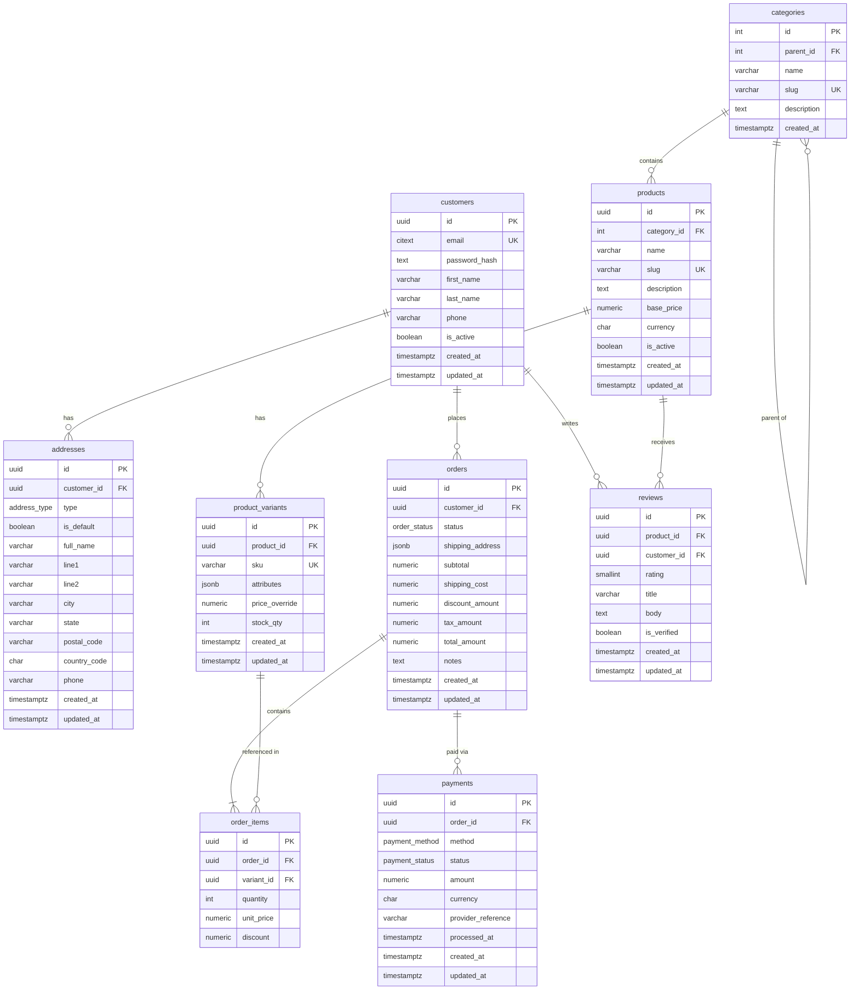

# E-Commerce — PostgreSQL Schema

> **TBDSP domain:** E-Commerce | **Database:** PostgreSQL 14+

This schema models a fully-featured online store covering customer accounts, a hierarchical product catalog, order management, payments, and reviews.

---

## Table of Contents

1. [Entity-Relationship Diagram](#entity-relationship-diagram)
2. [Tables at a Glance](#tables-at-a-glance)
3. [Table Details](#table-details)
4. [Design Decisions](#design-decisions)
5. [Setup Instructions](#setup-instructions)
6. [Sample Queries](#sample-queries)

---

## Entity-Relationship Diagram



> The standalone Mermaid source is also available in [`erd.mmd`](erd.mmd).

---

## Tables at a Glance

| Table | Rows (sample) | Purpose |
|-------|:---:|---------|
| `customers` | 7 | Registered user accounts |
| `addresses` | 8 | Billing / shipping addresses per customer |
| `categories` | 10 | Hierarchical product taxonomy |
| `products` | 10 | Master product catalog |
| `product_variants` | 19 | Purchasable SKUs (size, colour, …) |
| `orders` | 7 | Customer purchase orders |
| `order_items` | 11 | Line items within each order |
| `payments` | 8 | Payment transactions |
| `reviews` | 7 | Customer product ratings and reviews |

---

## Table Details

### `customers`

Stores registered users. Email is stored as `CITEXT` so uniqueness is enforced case-insensitively without extra lower-casing logic. Passwords are **never** stored in plain text — only a cryptographic hash (bcrypt / Argon2).

Key columns:

| Column | Type | Notes |
|--------|------|-------|
| `id` | `UUID` | Surrogate PK — prevents enumeration attacks |
| `email` | `CITEXT` | Unique login identifier |
| `password_hash` | `TEXT` | bcrypt / Argon2 hash |
| `is_active` | `BOOLEAN` | Soft-delete / account suspension flag |

---

### `addresses`

A customer may save multiple addresses. `is_default` marks the preferred address for each `type` (billing / shipping / both). Note: the `orders` table stores a **snapshot** of the address at order time, so updating an address later does not affect historical orders.

---

### `categories`

Uses an **adjacency-list** model (each row has an optional `parent_id`). This is the simplest approach for a tree with moderate depth. Use a recursive CTE to query full paths:

```sql
WITH RECURSIVE path AS (
    SELECT id, name, parent_id, 1 AS depth
    FROM   categories WHERE id = :leaf_id
    UNION ALL
    SELECT c.id, c.name, c.parent_id, path.depth + 1
    FROM   categories c
    JOIN   path ON c.id = path.parent_id
)
SELECT name FROM path ORDER BY depth DESC;
```

---

### `products` & `product_variants`

The catalog is split into two levels:

- **`products`** — the logical item (name, description, category, base price).
- **`product_variants`** — the physical SKU that can be purchased (colour, size, etc.). A variant may override the base price.

`attributes` is `JSONB` so variant dimensions (size, colour, material, …) are flexible without requiring schema migrations for each new attribute. A GIN index on `attributes` makes equality and containment queries fast.

---

### `orders` & `order_items`

`orders.shipping_address` is a `JSONB` snapshot of the address at the moment of purchase. This means address edits never silently change historical shipping data.

`order_items.unit_price` is also a snapshot — the price at the time of purchase. The total is never recomputed from the current product price.

`order_status` is a PostgreSQL `ENUM`: `pending → confirmed → processing → shipped → delivered` (or `cancelled` / `refunded`).

---

### `payments`

Multiple payment attempts per order are supported (e.g. a failed card followed by a successful one). Only the row with `status = 'captured'` represents a successful charge.

`provider_reference` stores the gateway's transaction ID (e.g. Stripe charge ID) for reconciliation.

---

### `reviews`

A customer can review each product **once** (`UNIQUE (product_id, customer_id)`). `is_verified` is set to `TRUE` only when the reviewer has a confirmed purchase of that product. `rating` is constrained to `1–5` via a `CHECK` constraint.

---

## Design Decisions

| Decision | Rationale |
|----------|-----------|
| UUID surrogate PKs | Prevents enumeration, enables distributed ID generation, safe to expose in URLs |
| `CITEXT` for email | Case-insensitive uniqueness without application-level lowercasing |
| `TIMESTAMPTZ` everywhere | All timestamps stored in UTC; no timezone surprises |
| `NUMERIC(12,2)` for money | Exact decimal arithmetic — never use `FLOAT` for currency |
| Address snapshot in orders | Guarantees historical accuracy even when customers update their addresses |
| Price snapshot in order_items | Prevents retroactive price changes from corrupting order history |
| `JSONB` for variant attributes | Flexible variant dimensions without schema migrations; GIN-indexed |
| Adjacency-list for categories | Simple, well-understood model; recursive CTEs handle tree traversal |
| `ENUM` types for status fields | Self-documenting, database-enforced allowed values |
| Auto-updating `updated_at` trigger | Consistent timestamp management without application boilerplate |

---

## Setup Instructions

### Prerequisites

- PostgreSQL 14 or later
- `psql` CLI or any compatible client (pgAdmin, DBeaver, TablePlus)

### Load schema and sample data

```bash
# 1. Create a target database (skip if you already have one)
createdb ecommerce_demo

# 2. Load the schema
psql -U <your_user> -d ecommerce_demo -f schema.sql

# 3. Load sample data (optional)
psql -U <your_user> -d ecommerce_demo -f sample_data.sql
```

### Reset / reload

```bash
dropdb ecommerce_demo
createdb ecommerce_demo
psql -U <your_user> -d ecommerce_demo -f schema.sql
psql -U <your_user> -d ecommerce_demo -f sample_data.sql
```

---

## Sample Queries

### 1. Customer order history with totals

```sql
SELECT
    c.first_name || ' ' || c.last_name AS customer,
    o.id AS order_id,
    o.status,
    o.total_amount,
    o.created_at::date AS order_date
FROM   orders  o
JOIN   customers c ON c.id = o.customer_id
ORDER BY o.created_at DESC;
```

### 2. Best-selling products (by units sold)

```sql
SELECT
    p.name,
    SUM(oi.quantity) AS units_sold
FROM   order_items   oi
JOIN   product_variants pv ON pv.id = oi.variant_id
JOIN   products         p  ON p.id  = pv.product_id
JOIN   orders           o  ON o.id  = oi.order_id
WHERE  o.status NOT IN ('cancelled', 'refunded')
GROUP BY p.name
ORDER BY units_sold DESC;
```

### 3. Average product ratings

```sql
SELECT
    p.name,
    ROUND(AVG(r.rating), 2) AS avg_rating,
    COUNT(*)                AS review_count
FROM   reviews  r
JOIN   products p ON p.id = r.product_id
GROUP BY p.name
ORDER BY avg_rating DESC;
```

### 4. Revenue by category (last 30 days)

```sql
SELECT
    cat.name               AS category,
    SUM(oi.unit_price * oi.quantity - oi.discount) AS revenue
FROM   order_items    oi
JOIN   orders          o   ON o.id   = oi.order_id
JOIN   product_variants pv ON pv.id  = oi.variant_id
JOIN   products         p  ON p.id   = pv.product_id
JOIN   categories       cat ON cat.id = p.category_id
WHERE  o.status NOT IN ('cancelled', 'refunded')
  AND  o.created_at >= NOW() - INTERVAL '30 days'
GROUP BY cat.name
ORDER BY revenue DESC;
```

### 5. Customers with failed payments

```sql
SELECT DISTINCT
    c.first_name || ' ' || c.last_name AS customer,
    c.email,
    pay.method,
    pay.amount
FROM   payments   pay
JOIN   orders     o ON o.id = pay.order_id
JOIN   customers  c ON c.id = o.customer_id
WHERE  pay.status = 'failed';
```
