# Medical — PostgreSQL Schema

> **TBDSP domain:** Medical | **Database:** PostgreSQL 14+

This schema models a production-ready healthcare platform covering patient records, medical practitioners, department routing, appointment scheduling, clinical encounters, ICD-coded diagnoses, a medication catalog with prescriptions, and laboratory order/result tracking.

---

## Table of Contents

1. [Entity-Relationship Diagram](#entity-relationship-diagram)
2. [Tables at a Glance](#tables-at-a-glance)
3. [Table Details](#table-details)
4. [Design Decisions](#design-decisions)
5. [Setup Instructions](#setup-instructions)
6. [Sample Queries](#sample-queries)

---

## Entity-Relationship Diagram

```mermaid
erDiagram

    departments {
        int         id          PK
        varchar     name
        varchar     code        UK
        text        description
        timestamptz created_at
    }

    patients {
        uuid        id                      PK
        citext      email                   UK
        text        password_hash
        varchar     first_name
        varchar     last_name
        date        date_of_birth
        gender      gender
        varchar     phone
        varchar     address_line1
        varchar     address_line2
        varchar     city
        varchar     state
        varchar     postal_code
        char        country_code
        varchar     emergency_contact_name
        varchar     emergency_contact_phone
        boolean     is_active
        timestamptz created_at
        timestamptz updated_at
    }

    practitioners {
        uuid              id               PK
        int               department_id    FK
        citext            email            UK
        text              password_hash
        varchar           first_name
        varchar           last_name
        practitioner_role role
        varchar           specialization
        varchar           license_number   UK
        varchar           phone
        boolean           is_active
        timestamptz       created_at
        timestamptz       updated_at
    }

    appointments {
        uuid               id               PK
        uuid               patient_id       FK
        uuid               practitioner_id  FK
        int                department_id    FK
        timestamptz        scheduled_at
        smallint           duration_minutes
        appointment_status status
        text               reason
        text               notes
        timestamptz        created_at
        timestamptz        updated_at
    }

    encounters {
        uuid           id               PK
        uuid           patient_id       FK
        uuid           practitioner_id  FK
        uuid           appointment_id   FK
        int            department_id    FK
        encounter_type type
        timestamptz    started_at
        timestamptz    ended_at
        text           chief_complaint
        text           clinical_notes
        text           discharge_summary
        timestamptz    created_at
        timestamptz    updated_at
    }

    diagnoses {
        uuid        id           PK
        uuid        encounter_id FK
        varchar     code
        text        description
        boolean     is_primary
        timestamptz noted_at
    }

    medications {
        int         id            PK
        varchar     rxnorm_code   UK
        varchar     name
        varchar     generic_name
        varchar     drug_class
        varchar     dosage_form
        varchar     strength
        boolean     is_controlled
        timestamptz created_at
    }

    prescriptions {
        uuid                id               PK
        uuid                encounter_id     FK
        int                 medication_id    FK
        uuid                prescribed_by    FK
        varchar             dosage
        varchar             frequency
        varchar             route
        smallint            duration_days
        smallint            refills_allowed
        text                instructions
        prescription_status status
        timestamptz         prescribed_at
        timestamptz         created_at
        timestamptz         updated_at
    }

    lab_orders {
        uuid             id           PK
        uuid             encounter_id FK
        uuid             ordered_by   FK
        varchar          panel_name
        varchar          loinc_code
        varchar          priority
        lab_order_status status
        text             notes
        timestamptz      ordered_at
        timestamptz      collected_at
        timestamptz      created_at
        timestamptz      updated_at
    }

    lab_results {
        uuid        id              PK
        uuid        lab_order_id    FK
        varchar     test_name
        varchar     loinc_code
        text        value
        varchar     unit
        varchar     reference_range
        boolean     is_abnormal
        timestamptz resulted_at
        timestamptz created_at
    }

    departments      ||--o{ practitioners  : "employs"
    departments      ||--o{ appointments   : "hosts"
    departments      ||--o{ encounters     : "handles"
    patients         ||--o{ appointments   : "books"
    patients         ||--o{ encounters     : "has"
    practitioners    ||--o{ appointments   : "attends"
    practitioners    ||--o{ encounters     : "conducts"
    practitioners    ||--o{ prescriptions  : "writes"
    practitioners    ||--o{ lab_orders     : "orders"
    appointments     ||--o| encounters     : "leads to"
    encounters       ||--o{ diagnoses      : "records"
    encounters       ||--o{ prescriptions  : "generates"
    encounters       ||--o{ lab_orders     : "generates"
    medications      ||--o{ prescriptions  : "prescribed in"
    lab_orders       ||--o{ lab_results    : "produces"
```



> The standalone Mermaid source is also available in [`erd.mmd`](erd.mmd).

---

## Tables at a Glance

| Table | Rows (sample) | Purpose |
|-------|:---:|---------|
| `departments` | 4 | Hospital departments and clinical specialties |
| `patients` | 8 | Patient demographic and contact records |
| `practitioners` | 5 | Medical professionals delivering care |
| `appointments` | 10 | Scheduled patient–practitioner appointments |
| `encounters` | 8 | Clinical visit records (the core patient chart) |
| `diagnoses` | 10 | ICD-10 diagnoses per encounter |
| `medications` | 12 | Approved medication catalog |
| `prescriptions` | 10 | Medication orders written during encounters |
| `lab_orders` | 8 | Laboratory test orders |
| `lab_results` | 16 | Individual result values for lab orders |

---

## Table Details

### `departments`

Represents hospital departments or clinical specialties (e.g., General Practice, Cardiology, Emergency Medicine). Practitioners are assigned to a primary department; appointments and encounters can be routed by department for reporting and scheduling.

| Column | Type | Notes |
|--------|------|-------|
| `id` | `SERIAL` | Lightweight surrogate PK |
| `code` | `VARCHAR(20)` | Short unique identifier, e.g. `"CARD"` |

---

### `patients`

Stores patient demographic information. Email uses `CITEXT` for case-insensitive uniqueness. `date_of_birth` is stored as `DATE` rather than a computed age — computed ages become stale; the age can always be derived at query time with `AGE(date_of_birth)`.

Key columns:

| Column | Type | Notes |
|--------|------|-------|
| `id` | `UUID` | Surrogate PK — prevents enumeration attacks |
| `email` | `CITEXT` | Unique login identifier, case-insensitive |
| `password_hash` | `TEXT` | bcrypt / Argon2 hash; never store plain-text |
| `date_of_birth` | `DATE` | Used to compute age dynamically at query time |
| `country_code` | `CHAR(2)` | ISO 3166-1 alpha-2, e.g. `US`, `GB` |
| `is_active` | `BOOLEAN` | Soft-delete / account suspension flag |

---

### `practitioners`

Medical professionals who deliver patient care. Each practitioner has a unique `license_number` (state/national medical licence) and a `role` enum that governs access and scheduling rules.

| Role | Description |
|------|-------------|
| `physician` | Licensed medical doctor — primary attending role |
| `nurse` | Registered nurse — clinical support |
| `nurse_practitioner` | Advanced-practice nurse — can prescribe |
| `physician_assistant` | Licensed PA — can diagnose and prescribe under supervision |
| `specialist` | Consultant in a named specialty (e.g., Cardiology) |
| `admin` | Administrative staff — scheduling and records |

---

### `appointments`

Scheduled visits linking a patient to a practitioner. An appointment may remain unattended (status `no_show`) or be converted to a clinical encounter when the patient checks in. `reason` is the chief complaint as the patient describes it at booking time.

`appointment_status` workflow: `scheduled → confirmed → checked_in → completed` (or `cancelled` / `no_show`).

A **partial index** on upcoming scheduled and confirmed appointments keeps scheduling queries fast without scanning historical rows.

---

### `encounters`

The core clinical record — every visit to the facility generates an encounter. Encounters may be linked to a prior appointment or arise from walk-in or emergency presentations (`appointment_id` is nullable).

- **`chief_complaint`** — the patient's primary concern in their own words.
- **`clinical_notes`** — the clinician's SOAP (Subjective / Objective / Assessment / Plan) or free-text notes.
- **`discharge_summary`** — populated for inpatient or emergency visits at discharge.
- A `CHECK` constraint ensures `ended_at > started_at` when both are present.

`encounter_type` values: `outpatient`, `inpatient`, `emergency`, `telehealth`.

---

### `diagnoses`

One or more ICD-10 (or ICD-11) coded diagnoses per encounter. `is_primary` flags the principal diagnosis, which drives billing and care-pathway logic. Multiple secondary diagnoses (comorbidities) can coexist on the same encounter.

Use the `idx_diagnoses_primary` partial index for fast retrieval of principal diagnoses.

---

### `medications`

A catalog of approved medications with standardised identifiers. `rxnorm_code` stores the [RxNorm](https://www.nlm.nih.gov/research/umls/rxnorm/) concept unique identifier (CUI), enabling interoperability with pharmacy and EHR systems. `is_controlled` flags substances requiring additional dispensing oversight.

---

### `prescriptions`

Medication orders written by practitioners during encounters. Key design points:

- **`dosage`** and **`frequency`** are free-text fields (e.g., `"500 mg"`, `"twice daily"`), keeping the schema flexible for any drug.
- **`route`** describes the administration method: `oral`, `IV`, `topical`, `subcutaneous injection`, etc.
- **`refills_allowed`** defaults to `0` (no refills). Pharmacy systems decrement this on each fill.
- **`duration_days`** is `NULL` for indefinite (chronic) prescriptions.
- A **partial index** on active prescriptions avoids scanning completed/cancelled historical rows.

---

### `lab_orders`

Laboratory test orders placed by practitioners during an encounter. `panel_name` and `loinc_code` identify the test using [LOINC](https://loinc.org/) standardised codes. `priority` follows clinical urgency conventions: `routine` (default), `urgent`, or `stat` (immediate, life-threatening).

`lab_order_status` workflow: `ordered → collected → in_progress → resulted` (or `cancelled`).

---

### `lab_results`

Individual result lines for a lab order. A single order may produce multiple rows (e.g., a **Basic Metabolic Panel** order yields Sodium, Potassium, Creatinine, BUN, Glucose, etc.). `value` is stored as `TEXT` to support both numeric values (`"9.2"`) and qualitative results (`"Positive"`, `"Detected"`). `reference_range` and `is_abnormal` let the application flag out-of-range values.

---

## Design Decisions

| Decision | Rationale |
|----------|-----------|
| UUID surrogate PKs for patients, practitioners, appointments, encounters, prescriptions, lab_orders, lab_results | Prevents enumeration attacks; safe to expose in URLs; enables distributed ID generation |
| `CITEXT` for `patients.email` and `practitioners.email` | Case-insensitive uniqueness without application-level lowercasing |
| `TIMESTAMPTZ` everywhere | All timestamps stored in UTC; no timezone surprises across deployments |
| `DATE` for `date_of_birth` | Age must be computed dynamically; storing a computed age creates a data-freshness problem |
| `TEXT` for `lab_results.value` | Lab results include qualitative values (e.g. "Positive", "Detected") — a numeric-only column would lose fidelity |
| Separate `appointments` and `encounters` tables | Appointments are forward-looking schedule entries; encounters are clinical visit records. A patient may walk in without an appointment; a scheduled appointment may never convert to an encounter (no-show) |
| ICD-10 codes in `diagnoses.code` | Standardised, internationally recognised coding system — required for billing and interoperability |
| RxNorm codes in `medications.rxnorm_code` | Standardised medication identifier compatible with pharmacy systems and EHR interoperability |
| LOINC codes in `lab_orders.loinc_code` and `lab_results.loinc_code` | Standardised test identifiers enable cross-system result exchange |
| `is_primary` flag in `diagnoses` | A visit may have multiple diagnoses; the primary drives billing and care pathways |
| `refills_allowed` defaults to 0 | Safest default for controlled substances and one-off prescriptions; explicit values required for repeat prescriptions |
| Partial indexes on active prescriptions and upcoming appointments | Dramatically reduces index size and query cost for the most common lookup patterns |
| Auto-updating `updated_at` trigger | Consistent timestamp management without application boilerplate |
| `ENUM` types for status and role fields | Self-documenting, database-enforced allowed values — prevents invalid strings entering the system |

---

## Setup Instructions

### Prerequisites

- PostgreSQL 14 or later
- `psql` CLI or any compatible client (pgAdmin, DBeaver, TablePlus)

### Load schema and sample data

```bash
# 1. Create a target database (skip if you already have one)
createdb medical_demo

# 2. Load the schema
psql -U <your_user> -d medical_demo -f schema.sql

# 3. Load sample data (optional)
psql -U <your_user> -d medical_demo -f sample_data.sql
```

### Reset / reload

```bash
dropdb medical_demo
createdb medical_demo
psql -U <your_user> -d medical_demo -f schema.sql
psql -U <your_user> -d medical_demo -f sample_data.sql
```

---

## Sample Queries

### 1. Patient appointment history with practitioner and department

```sql
SELECT
    p.first_name || ' ' || p.last_name      AS patient,
    pr.first_name || ' ' || pr.last_name    AS practitioner,
    d.name                                  AS department,
    a.scheduled_at::date                    AS appointment_date,
    a.status,
    a.reason
FROM   appointments a
JOIN   patients      p  ON p.id  = a.patient_id
JOIN   practitioners pr ON pr.id = a.practitioner_id
LEFT JOIN departments d ON d.id  = a.department_id
ORDER BY a.scheduled_at DESC;
```

---

### 2. Active prescriptions for a patient

```sql
SELECT
    pt.first_name || ' ' || pt.last_name    AS patient,
    m.name                                  AS medication,
    rx.dosage,
    rx.frequency,
    rx.route,
    rx.refills_allowed,
    rx.prescribed_at::date                  AS prescribed_date,
    pr.first_name || ' ' || pr.last_name    AS prescriber
FROM   prescriptions rx
JOIN   encounters    e  ON e.id  = rx.encounter_id
JOIN   patients      pt ON pt.id = e.patient_id
JOIN   medications   m  ON m.id  = rx.medication_id
JOIN   practitioners pr ON pr.id = rx.prescribed_by
WHERE  pt.id    = 'a1000000-0000-0000-0000-000000000002'
  AND  rx.status = 'active'
ORDER BY rx.prescribed_at DESC;
```

---

### 3. Abnormal lab results flagged for a patient

```sql
SELECT
    pt.first_name || ' ' || pt.last_name    AS patient,
    lo.panel_name,
    lr.test_name,
    lr.value,
    lr.unit,
    lr.reference_range,
    lr.resulted_at::date                    AS result_date
FROM   lab_results  lr
JOIN   lab_orders   lo ON lo.id  = lr.lab_order_id
JOIN   encounters   e  ON e.id   = lo.encounter_id
JOIN   patients     pt ON pt.id  = e.patient_id
WHERE  lr.is_abnormal = TRUE
ORDER BY pt.last_name, lr.resulted_at DESC;
```

---

### 4. Primary diagnoses per encounter with ICD codes

```sql
SELECT
    e.started_at::date                      AS visit_date,
    pt.first_name || ' ' || pt.last_name    AS patient,
    pr.first_name || ' ' || pr.last_name    AS practitioner,
    e.type                                  AS encounter_type,
    d.code                                  AS icd_code,
    d.description                           AS diagnosis
FROM   diagnoses     d
JOIN   encounters    e  ON e.id  = d.encounter_id
JOIN   patients      pt ON pt.id = e.patient_id
JOIN   practitioners pr ON pr.id = e.practitioner_id
WHERE  d.is_primary = TRUE
ORDER BY e.started_at DESC;
```

---

### 5. Practitioners ranked by encounters seen (last 90 days)

```sql
SELECT
    pr.first_name || ' ' || pr.last_name    AS practitioner,
    pr.role,
    d.name                                  AS department,
    COUNT(e.id)                             AS encounters_seen
FROM   practitioners pr
JOIN   encounters    e  ON e.practitioner_id = pr.id
LEFT JOIN departments d ON d.id = pr.department_id
WHERE  e.started_at >= NOW() - INTERVAL '90 days'
GROUP BY pr.id, d.name
ORDER BY encounters_seen DESC;
```

---

### 6. Controlled substances prescribed in the last 30 days

```sql
SELECT
    pt.first_name || ' ' || pt.last_name    AS patient,
    m.name                                  AS medication,
    m.drug_class,
    rx.dosage,
    rx.frequency,
    rx.refills_allowed,
    pr.first_name || ' ' || pr.last_name    AS prescriber,
    rx.prescribed_at::date                  AS prescribed_date
FROM   prescriptions rx
JOIN   medications   m  ON m.id  = rx.medication_id
JOIN   encounters    e  ON e.id  = rx.encounter_id
JOIN   patients      pt ON pt.id = e.patient_id
JOIN   practitioners pr ON pr.id = rx.prescribed_by
WHERE  m.is_controlled    = TRUE
  AND  rx.prescribed_at  >= NOW() - INTERVAL '30 days'
ORDER BY rx.prescribed_at DESC;
```
